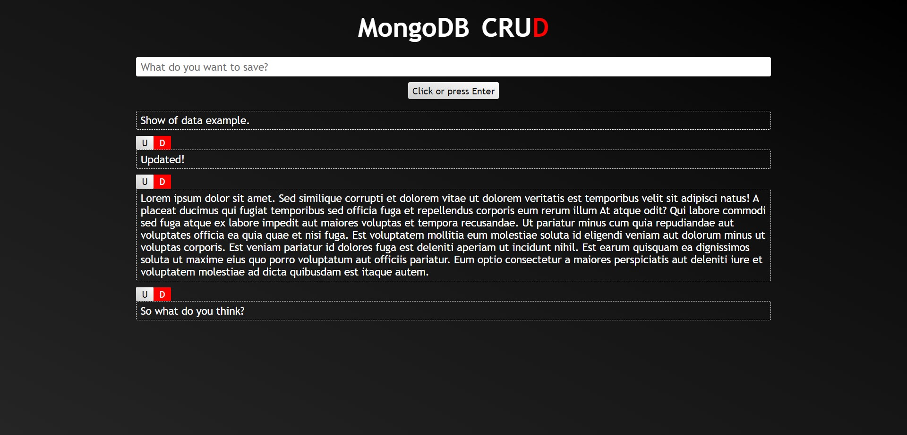

<h2 align="center">Deploy link:</h2>

The MongoDB CRUD repository: [Alef-Basilio/MongoDB-CRUD---FrontEnd---08-2024](https://github.com/Alef-Basilio/MongoDB-CRUD---FrontEnd---08-2024)
</br>

If you want to test: @[MongoDB CRUD](https://mongodbcrud-backend-f8fole6uw-alef-basilios-projects.vercel.app/) or just see: @[MongoDB API](https://nodeback-4zha.onrender.com)

```
https://mongodbcrud-backend-f8fole6uw-alef-basilios-projects.vercel.app/
```
```
https://nodeback-4zha.onrender.com
```


<h1 align="center" style="color: #805ad5; font-weight: bold;">MongoDB API</h1>
<p align="center">
Topics: 
<a href="#tech">Technolgies</a> |
<a href="#how">How was made</a> |
<a href="#obj">Objective</a>
</p>


<p align="center">
<b>A connection with a non-relational database that can be used by users.</b>
</p>


<p align="center">
  <p align="center">
    
  </p>
</p>


<h2 id="tech" align="center">Technologies</h2>
Node.js and JavaScript.

### Database:
MongoDB.


<h2 id="how" align="center">How was made</h2>
Using technologies linked to JavaScript to create a server and make queries.
</br>
Separating the front and the back by the Render website web service and Vercel.


<h2 id="obj" align="center">Objective</h2>
To better understand the architecture of web applications.
